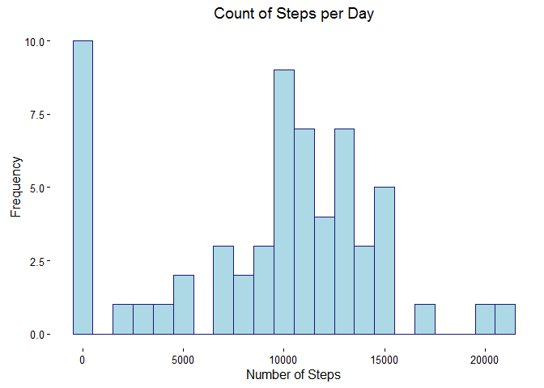
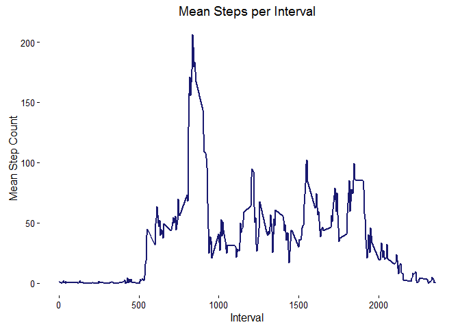
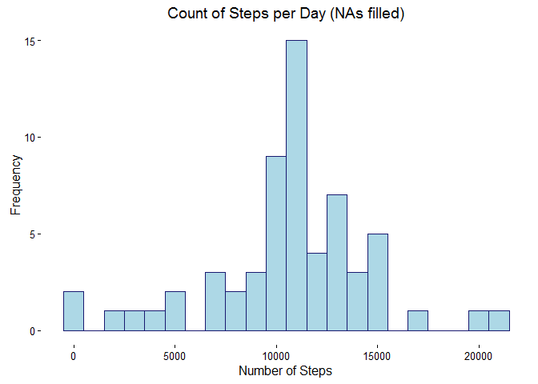
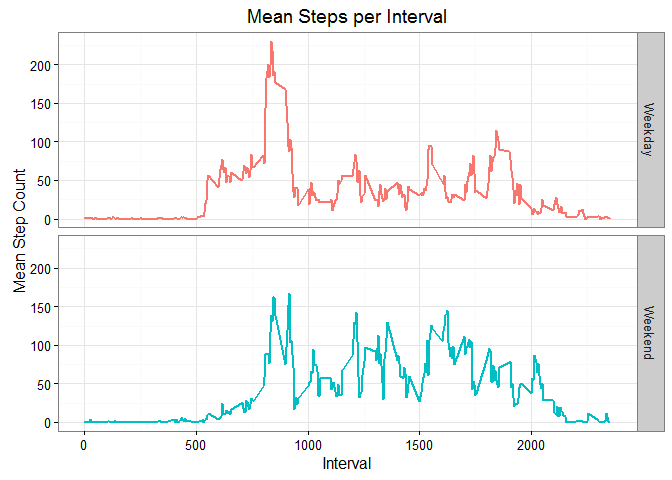

# Reproducible Research: Peer Assessment 1


## Loading and preprocessing the data

```r
get_data <- function(url) {
  temp <- tempfile()
  download.file(url, temp)
  data <- read.csv(unz(temp, 'activity.csv'), stringsAsFactors = FALSE, na.strings = "NA", header = TRUE)
  data$date <- ymd(data$date)
  return(data)
}

url <- "https://d396qusza40orc.cloudfront.net/repdata%2Fdata%2Factivity.zip"

data <- get_data(url)
```

## What is mean total number of steps taken per day?

For this part of the assignment, you can ignore the missing values in the dataset.

1. Calculate the total number of steps taken per day


```r
total_steps <- data %>%
  group_by(date) %>%
  summarize(steps = sum(steps, na.rm = TRUE))

mean_steps <- mean(total_steps$steps)
median_steps <- median(total_steps$steps)
```

2. If you do not understand the difference between a histogram and a barplot, research the difference between them. Make a histogram of the total number of steps taken each day


```r
qplot(total_steps$steps, binwidth = 1000, fill = I("lightblue"), col = I("midnightblue")) +
  theme_classic() +
  labs(x = "Number of Steps", y = "Frequency", title = "Count of Steps per Day")
```

<!-- -->

3. Calculate and report the mean and median of the total number of steps taken per day

Mean steps per day: 9354.23

Median steps per day: 10395


## What is the average daily activity pattern?

1. Make a time series plot (i.e. type = "l") of the 5-minute interval (x-axis) and the average number of steps taken, averaged across all days (y-axis)


```r
interval_avg <- data %>%
  group_by(interval) %>%
  summarize(avg_steps = mean(steps, na.rm = TRUE))
```


```r
ggplot(interval_avg, aes(x = interval, y = avg_steps)) +
  geom_line(size = 1, color = "midnightblue") +
  theme_classic() +
  labs(title = "Mean Steps per Interval", x = "Interval", y = "Mean Step Count")
```

<!-- -->

2. Which 5-minute interval, on average across all the days in the dataset, contains the maximum number of steps?


```r
max_steps <- filter(interval_avg, avg_steps == max(avg_steps))$interval
```

The maximum number of steps occurs in interval 835.


## Imputing missing values

Note that there are a number of days/intervals where there are missing values (coded as NA). The presence of missing days may introduce bias into some calculations or summaries of the data.

1. Calculate and report the total number of missing values in the dataset (i.e. the total number of rows with NAs)


```r
total_na <- sum(!complete.cases(data$steps))
```

Total missing values: 2304

2. Devise a strategy for filling in all of the missing values in the dataset. The strategy does not need to be sophisticated. For example, you could use the mean/median for that day, or the mean for that 5-minute interval, etc.

Missing values will be replaced with the average number of steps for that interval. e.g. an NA value for interval 835 would be replaced with a step value of 
206.17.

3. Create a new dataset that is equal to the original dataset but with the missing data filled in.


```r
complete_data <- data.frame()

for(i in unique(data$interval)) {
  temp_data <- filter(data, interval == i)
  temp_data <- replace(temp_data, is.na(temp_data), round(mean(temp_data$steps, na.rm = TRUE), 2))
  complete_data <- rbind(complete_data, temp_data)
}
```

4. Make a histogram of the total number of steps taken each day and Calculate and report the mean and median total number of steps taken per day. Do these values differ from the estimates from the first part of the assignment? What is the impact of imputing missing data on the estimates of the total daily number of steps?


```r
complete_total <- complete_data %>%
  group_by(date) %>%
  summarize(total_steps = sum(steps))
```


```r
qplot(complete_total$total_steps, binwidth = 1000, fill = I("lightblue"), col = I("midnightblue")) +
  theme_classic() +
  labs(x = "Number of Steps", y = "Frequency", title = "Count of Steps per Day (NAs filled)")
```

<!-- -->


```r
complete_mean <- mean(complete_total$total_steps)
complete_median <- median(complete_total$total_steps)

compare <- data.frame(`With NA` = c(mean_steps, median_steps), 
                      `NA Filled` = c(complete_mean, complete_median))
rownames(compare) <- c("Mean", "Median")
```


           With.NA   NA.Filled
-------  ---------  ----------
Mean       9354.23    10766.18
Median    10395.00    10766.13

Both mean and median are slightly higher with NA values filled. Filling NA values with the mean number of steps for that interval brings the mean and median number of steps much closer together. It also dramatically reduces the number of days with 0 steps recorded.

## Are there differences in activity patterns between weekdays and weekends?
1. Create a new factor variable in the dataset with two levels – “weekday” and “weekend” indicating whether a given date is a weekday or weekend day.


```r
is_weekend <- function(date) {
  if(weekdays(date) %in% c("Saturday", "Sunday")) {
    return("Weekend")
  } else {
    return("Weekday")
  }
}

complete_data$weekday <- sapply(complete_data$date, is_weekend)
complete_data$weekday <- as.factor(complete_data$weekday)
```

2. Make a panel plot containing a time series plot (i.e. type = "l") of the 5-minute interval (x-axis) and the average number of steps taken, averaged across all weekday days or weekend days (y-axis). See the README file in the GitHub repository to see an example of what this plot should look like using simulated data.


```r
complete_avg <- complete_data %>%
  group_by(weekday, interval) %>%
  summarize(avg = mean(steps))
```


```r
ggplot(complete_avg, aes(x = interval, y = avg, color = weekday)) +
  geom_line(size = 1) +
  theme_bw() +
  guides(color = FALSE) + 
  labs(title = "Mean Steps per Interval", x = "Interval", y = "Mean Step Count") +
  facet_grid(weekday~.)
```

<!-- -->
